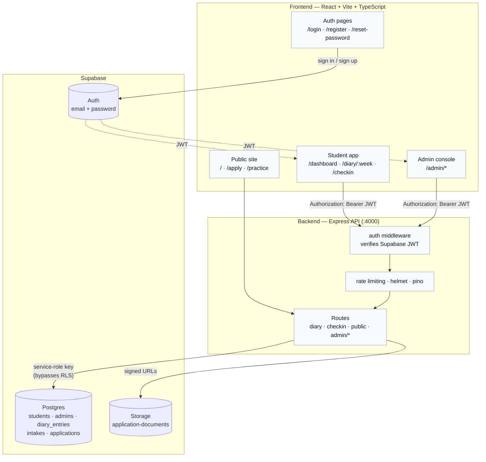

# Architecture

Three pieces: a React SPA, an Express API, and Supabase (Postgres + Auth +
Storage). The frontend talks to Supabase Auth directly for sign-in/sign-up;
everything else goes through the Express API, which is the only thing that
holds the Supabase service-role key.

## Why it's shaped this way

- **Supabase Auth is called directly from the browser** for sign-in, so
  password handling never touches our own server. The resulting JWT is
  then sent as a bearer token on every API request.
- **The Express API is the only service-role client.** Postgres has RLS
  enabled on `diary_entries` and `students` as defense-in-depth, but since
  the backend uses the service-role key (which bypasses RLS), the real
  access control is `backend/src/middleware/auth.js` checking the JWT and
  role on every request — not the database policies.
- **Roster gating replaces open signup.** A student can only self-register
  if their email + student ID already exist as a row an admin added.
  Admins are provisioned out-of-band via `npm run create-admin`, never
  through a form.
- **No migration runner.** Schema changes are numbered SQL files in
  `backend/database/`, pasted into the Supabase SQL Editor by hand — simple
  enough for this project's scale, and every file is idempotent.

## Request flow (student submitting a diary entry)

1. Browser calls `supabase.auth.signInWithPassword()` → Supabase Auth
   returns a JWT, stored client-side by the Supabase JS client.
2. The SPA calls `POST /api/diary/:week` with `Authorization: Bearer <jwt>`.
3. `middleware/auth.js` verifies the JWT against Supabase, loads the
   matching `students` row, and attaches it to the request.
4. The route handler validates the body with a zod schema
   (`src/schemas/*.schema.js`), then reads/writes `diary_entries` using the
   service-role Supabase client.
5. A submitted entry becomes read-only — resubmission is blocked in the
   route handler, not just in the UI.

## Directory map

| Path | What's there |
| --- | --- |
| `frontend/src/pages/landing/` | Public marketing site |
| `frontend/src/pages/student/`, `pages/admin/` | Authenticated app screens |
| `frontend/src/components/layout/` | Sidebar + shell shared by student/admin |
| `backend/src/routes/` | Express routes (`admin/` for admin-only ones) |
| `backend/src/middleware/` | JWT auth, error handling |
| `backend/src/schemas/` | zod request validation |
| `backend/database/` | Numbered SQL migrations |
| `docs/` | This documentation |
